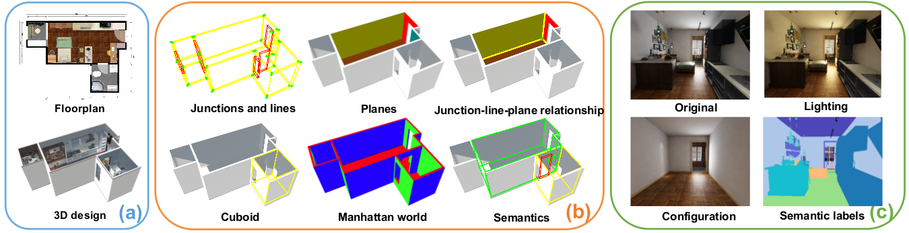

# Data Organization

<p align="center">

</p>

There is a separate subdirectory for every scene (_i.e._, house design), which is named by a unique ID. Within each scene directory, there are separate directories for different types of data as follows:

```
scene_<sceneID>
├── 2D_rendering
│   └── <roomID>
│       ├── panorama
│       │   ├── <empty/simple/full> -> empty: only scene, no objects/bbox objects; simple: a few; full: all objects (in Structured_panorama_XX)
│       │   │   ├── rgb_<cold/raw/warm>light.png
│       │   │   ├── semantic.png -> empty/simple/full in Structured_panorama_XX
│       │   │   ├── instance.png -> panorama/full in Structured3D_bbox
│       │   │   ├── albedo.png -> empty/simple/full in Structured_panorama_XX
│       │   │   ├── depth.png -> empty/simple/full in Structured_panorama_XX
│       │   │   └── normal.png -> empty/simple/full in Structured_panorama_XX
│       │   ├── layout.txt -> in Structured_panorama_XX
│       │   └── camera_xyz.txt -> in Structured_panorama_XX
│       └── perspective
│           └── <empty/full> -> empty: only scene, no objects/bbox objects; simple: a few; full: all objects
│               └── <positionID> -> in each room, a few different photos
│                   ├── rgb_rawlight.png -> empty in Structured_perspective_empty_XX, full in Structured_perspective_full_XX
│                   ├── semantic.png -> empty in Structured_perspective_empty_XX, full in Structured_perspective_full_XX
│                   ├── instance.png -> perspective/full in Structured3D_bbox
│                   ├── albedo.png -> empty in Structured_perspective_empty_XX, full in Structured_perspective_full_XX
│                   ├── depth.png -> empty in Structured_perspective_empty_XX, full in Structured_perspective_full_XX
│                   ├── normal.png -> empty in Structured_perspective_empty_XX, full in Structured_perspective_full_XX
│                   ├── layout.json -> has junctions and planes for this photo akin to annotation_3d.json. For junctions, the IDs refer to annotation_3d.json, and ones that are fake are ID of null. For junctions, the 2d coordinates are given, as well as if the junction is visible. Planes are also given; the visible mask (including occlusions) expresed as junctions and the amodal mask (ignoring occlusion) expressed as junctions.
│                   └── camera_pose.txt -> for the positionID (the photo), this gives camera position in the global coordinates
├── bbox_3d.json -> in Structured3D_bbox
└── annotation_3d.json -> in Structured3D_annotation_3d (identical copy in Structured_panorama_XX, Structured_perspective_empty_XX)
```

# Annotation Format

We provide the primitive and relationship based structure annotation for each scene, and oriented bounding box for each object instance.

**Structure annotation (`annotation_3d.json`)**: see all the room types [here](metadata/room_types.txt).

```
{
  // PRIMITVIES
  "junctions":[
    {
      "ID":             : int,
      "coordinate"      : List[float]       // 3D vector; this is the location of the exact point of the junction/vertex (these are the vertices at the intersection of edges)
    }
  ],
  "lines": [
    {
      "ID":             : int,
      "point"           : List[float],      // 3D vector; a point on the line (combined with "direction", this defines the line, though there are no terminating points in this location; those are the junctions)
      "direction"       : List[float]       // 3D vector; the line direction
    }
  ],
  "planes": [
    {
      "ID":             : int,
      "type"            : str,              // ceiling, floor, wall
      "normal"          : List[float],      // 3D vector, the normal points to the empty space
      "offset"          : float             // shortest euclidean distance from world origin (0,0,0) to plane. Hence, starting from world origin, you go direction "normal" for distance "offset" to reach a point on the plane.
    }
  ],
  // RELATIONSHIPS
  "semantics": [
    {
      "ID"              : int,
      "type"            : str,              // room type, door, window
      "planeID"         : List[int]         // indices of the planes that define this particular room, door or window
    }
  ],
  "planeLineMatrix"     : Matrix[int],      // matrix W_1 where the ij-th entry is 1 iff l_i is on p_j (tells you if line l_i is on plane p_j)
  "lineJunctionMatrix"  : Matrix[int],      // matrix W_2 here the mn-th entry is 1 iff x_m is on l_nj (tells you if junction/vertex x_m is a point on line l_nj)
  // OTHERS
  "cuboids": [
    {
      "ID":             : int,
      "planeID"         : List[int]         // The 6 indices of the planes defining the cuboid (hexahedron) that is a room (see "cuboid" in the above image)
    }
  ]
  "manhattan": [
    {
      "ID":             : int,
      "planeID"         : List[int]         // indices of the planes that all have the same normal direction (see the image above)
    }
  ]
}
```

**Bounding box (`bbox_3d.json`)**: the oriented bounding box annotation in world coordinate, same as the [SUN RGB-D Dataset](http://rgbd.cs.princeton.edu).

```
[
  {
    "ID"        : int,              // instance id
    "basis"     : Matrix[float],    // basis vectors defining the 3d bbox; one row is one basis
    "coeffs"    : List[float],      // radii in each dimension; each represents the distance from the centroid to a face of the bbox. For example, for coeffs=[c1, c2, c3], we have the bbox (length, width, height)=(c1,c2,c3). Using basis vectors b1,b2,b3, we can find the 8 corners using centroid +/- c1*b1 +/- c2*b2 +/- c3*b3
    "centroid"  : List[float],      // 3D centroid of the bounding box
  }
]
```

For each image, we provide semantic, instance, albedo, depth, normal, layout annotation and camera position. Please note that we have different layout and camera annotation formats for panoramic and perspective images.

**Semantic annotation (`semantic.png`)**: unsigned 8-bit integers within a PNG. We use [NYUv2](https://cs.nyu.edu/~silberman/datasets/nyu_depth_v2) 40-label set, see all the label ids [here](metadata/labelids.txt). Classifies both the bbox objects as well as floor, ceiling etc. 

**Instance annotation (`instance.png`)**: unsigned 16-bit integers within a PNG. We only provide instance annotation for full configuration. The maximum value (65535) denotes _background_. The `Structured3D_annotation_3d` stores panorama/full and perspective/full for these. panorama/full gives a mask of the objects in a panoramic scene; perspective/full, for different perspectives, gives the same kind of mask.

**Albedo data (`albedo.png`)**: unsigned 8-bit integers within a PNG. The raw colour/texture before lighting/shading/reflections. It is the proportion of incident light scattered/reflected by the surface.

**RGB (cold lighting) (`rgb_coldlight.png`)**: PNG image, with lighting temperature cold.

**RGB (warm lighting) (`rgb_warmlight.png`)**: PNG image, with lighting temperature warm.

**RGB (raw lighting) (`rgb_rawlight.png`)**: PNG image, with the unadjusted lighting temperature.

**Depth data (`depth.png`)**: unsigned 16-bit integers within a PNG. The units are millimeters, a value of 1000 is a meter. A zero value denotes _no reading_.

**Normal data (`normal.png`)**: unsigned 8-bit integers within a PNG (x, y, z), where the integer values in the file are 128 \* (1 + n), where n is a normal coordinate in range the [-1, 1]. This encodes the orientation of the surface.

**Layout annotation for panorama (`layout.txt`)**: an ordered list of 2D positions of the junctions (same as [LayoutNet](https://github.com/zouchuhang/LayoutNet) and [HorizonNet](https://github.com/sunset1995/HorizonNet)). The order of the junctions is shown in the figure below. In our dataset, the cameras of the panoramas are aligned with the gravity direction, thus a pair of ceiling-wall and floor-wall junctions share the same x-axis coordinates.

<p align="center">

</p>

**Layout annotation for perspective (`layout.json`)**: We also include the junctions formed by line segments intersecting with each other or image boundary. We consider the visible and invisible parts caused by the room structure instead of furniture.

```
{
  "junctions":[
    {
      "ID"            : int,              // corresponding 3D junction id, none corresponds to fake 3D junction
      "coordinate"    : List[int],        // 2D location in the camera coordinate
      "isvisible"     : bool              // this junction is whether occluded by the other walls
    }
  ],
  "planes": [
    {
      "ID"            : int,              // corresponding 3D plane id
      "visible_mask"  : List[List[int]],  // visible segmentation mask, list of junctions ids
      "amodal_mask"   : List[List[int]],  // amodal segmentation mask, list of junctions ids
      "normal"        : List[float],      // normal in the camera coordinate
      "offset"        : float,            // offset in the camera coordinate
      "type"          : str               // ceiling, floor, wall
    }
  ]
}
```

**Camera location for panorama (`camera_xyz.txt`)**: A 3-vector with the camera position for the panoramic view. For each panoramic image, we only store the camera location in millimeters in global coordinates. The direction of the camera is always along the negative y-axis. The z-axis is upward.

**Camera location for perspective (`camera_pose.txt`)**: For each perspective image, we store the camera location and pose in global coordinates.

```
vx vy vz tx ty tz ux uy uz xfov yfov 1
```

where `(vx, vy, vz)` is the eye viewpoint of the camera in millimeters, `(tx, ty, tz)` is the view direction, `(ux, uy, uz)` is the up direction, and `xfov` and `yfov` are the half-angles of the horizontal and vertical fields of view of the camera in radians (the angle from the central ray to the leftmost/bottommost ray in the field of view), same as the [Matterport3D Dataset](https://github.com/niessner/Matterport).

# Data Status on Nibi

In zipped form, the total storage space is 611GB.

The perspective folders are in 7z format, on the cluster these can be unzipped as follows:

```bash
wget https://github.com/ip7z/7zip/releases/download/26.01/7z2601-linux-x64.tar.xz
tar -xf 7z2601-linux-x64.tar.xz
~/7zz x data/Structured3D_perspective_empty_00.zip -odata/Structured3D_perspective_empty_00
```

# Ideas

1. What tasks can we come up with in addition to what are already present to enrich training?
2. Given the information that we have, is there a way that we can teach the AI to calculate distances and depths, which is what we noticed being a problem before?
3. Is the panorama appearance of the data what we want, or should we un-panorama it?

# Usage in Other Datasets

How does SPAR-7M use these data?